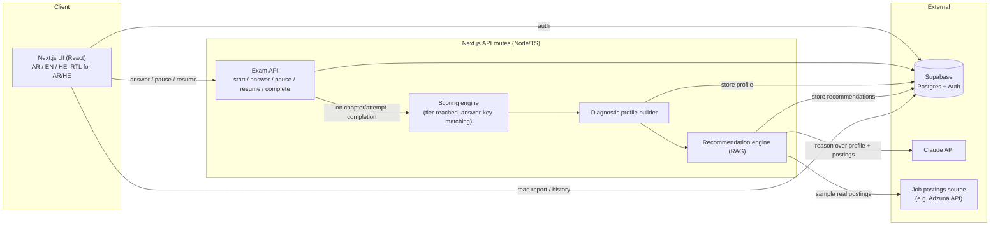

# ARCHITECTURE.md

System design for the project described in `claude.md` (Intent, feature
spec, exam mechanics) and `pitch.txt`. Reflects decisions made so far; still
-open items (LLM cost control, final chapter list) are called out at the end
rather than designed around, since they don't block starting to build.

**Rendered diagrams** (component overview, both data-flow sequences, and the
data model as an ER diagram) live here, since plain-text mermaid blocks
don't render as actual diagrams in most local editors:
https://claude.ai/code/artifact/82d12f20-92a6-4a1c-bc8f-da5e523df50c

## Component overview



Everything server-side lives in Next.js API routes for v1 — one deployable,
one language (TypeScript), matching the tech stack decision in claude.md. No
separate backend service unless something concrete forces it later.

## Screens (from claude.md → feature spec)

| Route | Behavior |
|---|---|
| `/` | Logged out: marketing/explainer + "Start Assessment" CTA → sign-up. Logged in: dashboard — latest result summary + "Start new assessment" |
| `/exam/[attemptId]` | Chapter-by-chapter adaptive exam. Resumes exactly where left off (never mid-question) |
| `/results/[attemptId]` | Report: readiness score, chapter breakdown, strengths/weaknesses, learning path, job matches |
| `/history` | List of all past attempts for the account, links to each report |
| `/settings` | Change password, delete account/data, language preference |

Language switcher (AR/EN/HE) is global UI chrome, not a separate route.

## The two core data flows

**1. Taking the exam → diagnostic profile**
Per chapter: questions escalate in difficulty; `ExamAPI` serves the next
question by drawing at random from that difficulty tier's question pool (not
a fixed ladder — needed because retakes are allowed and must not just replay
the same questions). A chapter ends after 3 wrong answers in a row. The user
can pause after any fully-answered question and resume later — in-progress
state (current tier, current wrong-streak) is persisted, never reconstructed
from scratch. Once all chapters are done, `ScoreEngine` computes each
chapter's score from the highest difficulty tier sustained (not raw
percent-correct — see claude.md), and `ProfileBuilder` aggregates chapter
scores into one `diagnostic_profiles` row for that attempt.

This profile row is the artifact the moat depends on staying unified
(claude.md → Positioning) — job matching and course recs both read *this*,
never a re-derived or parallel copy of it. Because retakes are allowed, a
user accumulates multiple profile rows over time (one per attempt), which is
exactly what lets recommendations sharpen as engagement grows.

**2. Diagnostic profile → recommendations**
`RecEngine` takes a `diagnostic_profiles` row and produces both outputs in
one pass: pulls a sample of real job postings, sends postings + profile to
Claude for job-title matches with reasoning, and separately prompts Claude
for course recommendations against each weak chapter, verifying links
resolve before storing. Results are cached in `recommendations`, keyed to
the profile — re-viewing a report should not re-trigger a paid LLM call.
(This cache is also the natural first lever for the still-open
LLM-cost-control question, whichever way that gets decided.)

## Data model (Postgres via Supabase)

| Table | Purpose |
|---|---|
| `auth.users` | Managed by Supabase Auth — accounts are required |
| `chapters` | Reference data: the 6 v1 chapters, key/name/sort order |
| `questions` | Bank of exam questions: chapter_id, difficulty_tier, type (mcq / spot_bug / fill_blank / scenario), prompt, options, answer_key. Multiple questions per (chapter, tier) — required for retake rotation |
| `exam_attempts` | One row per attempt: user_id, status (in_progress / completed), started_at, completed_at. A user can have many rows (retakes allowed) |
| `chapter_progress` | Per-attempt, per-chapter in-progress state: current difficulty tier, current wrong-streak count, status (not_started / in_progress / completed) — what makes pause/resume-after-any-question work |
| `responses` | One row per answered question: attempt_id, question_id, user_answer, is_correct, answered_at |
| `chapter_scores` | Per-chapter rollup for an attempt: attempt_id, chapter_id, score (0–100, from tier reached), percent_correct (supporting data only) |
| `diagnostic_profiles` | The unified profile: attempt_id, user_id, profile_json (chapter scores + derived strengths/weaknesses), created_at |
| `recommendations` | Cached RAG output: profile_id, type (job_match / course_rec), payload_json, generated_at |

`diagnostic_profiles` and `recommendations` are the two tables worth
protecting the shape of; `chapter_progress` is what makes fine-grained
pause/resume actually work rather than just being a status flag.

## Folder structure (Next.js App Router)

```
/app
  /(marketing)/            landing page (logged-out view of "/")
  /exam/[attemptId]/...     chapter-by-chapter adaptive exam flow
  /results/[attemptId]/...  report page
  /history/...              list of past attempts
  /settings/...              account settings, language preference
  /api
    /exam/start
    /exam/[attemptId]/answer
    /exam/[attemptId]/pause
    /exam/[attemptId]/complete        -> triggers ScoreEngine + ProfileBuilder
    /recommendations/[profileId]      -> triggers RecEngine or reads cache
/lib
  /scoring        tier-reached + answer-key grading
  /profile        profile aggregation
  /recommend      RAG orchestration: prompt building, Claude client, job-source client, link verification
  /i18n           AR / EN / HE UI strings (next-intl or equivalent)
/db
  /schema.sql (or Prisma schema)
  /seed         chapters + starter question bank (multiple questions per tier)
```

Arabic and Hebrew are both RTL — the UI layer needs real `dir="rtl"` layout
support per locale, not just translated strings.

## External dependencies

- **Supabase** — Postgres + Auth, free tier
- **Claude API** — recommendation reasoning, called only from `/lib/recommend`, never from the client
- **Job postings source** — e.g. Adzuna API free tier, or scraping a handful of public listings; feeds `RecEngine`
- **Hosting** — Vercel (pairs with Next.js), free tier

## Not designed around yet (see claude.md → Open questions)

- **LLM cost-control strategy**: the `recommendations` cache helps, but rate
  limiting / cost ceilings for free users isn't decided — matters more now
  that retakes are allowed (more attempts → more potential LLM calls).
- **Final chapter list**: adding/removing/renaming a chapter only touches
  `chapters` + `questions` + `chapter_scores`/`chapter_progress` shape — the
  architecture doesn't need to change to accommodate this later.
- **Question bank sizing**: how many questions per (chapter, tier) is enough
  that retakes don't feel repetitive — not yet estimated.
